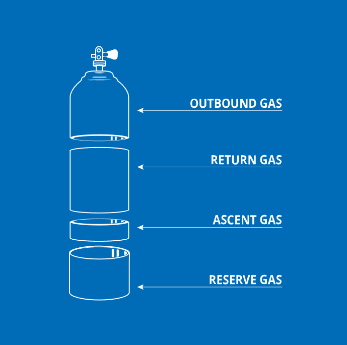

# Advanced Open Water
## Thinking like a diver
### Four Central Dive Skills

1. Planning dives with secondary objectives
2. Developing and applying situational awareness
3. Managing task loading
4. Maintaining good dive habits

These all share 3 characteristics:
1. Apply to all dives
2. Make the dives more enjoyable, more efficient, and reduce risk
3. They integrate with all other dive skills

### Planning Dives with Secondary Objectives

Every dive has one single primary objective that never changes. **All divers to return safely.**

A secondary objectives is anything you want to complete whilst returning safe. This can range from sight seeing, finding a specific fish, night diving, taking photos, etc.

Whatever it is, you must always remember that these objectives are always secondary.
Most incidents happen when the secondary objective becomes the primary; by exceeding planned limits, time, depth, gas supply, heat, etc. Due to the diver wanting to complete their secondary objective.
You can always come back to finish an objective if you always follow the first primary objective. **Don't push your safety margin.**

### Situational Awareness

Situational awareness is your perception and understanding of what is going on around you and what it means. It is more than just seeing and hearing, its having the ability to filter out what is not so important and what is from your senses.

It is similar ot spheres of awareness that are around you:


Initially, it starts very small as you are learning a new skill and it is all unfamiliar ground. After more dives though, the sphere will grow and expand your understanding of your surroundings

#### Gas Management
Situational awareness is not just your surroundings, it is also your gas management. Mainly:
* Prevent running out of gas
* Alow a reasonable reserve for handling emergencies / problems

To make sure you reach these goals each dive, think of your tank in sections:


* Outbound gas
  * Used for your descent, and to carry out your secondary objective.
* Return gas
  * Used for returning to your ascent point.
* Ascent gas
  * Used for making a safety stop and exit / ascent. Sometimes you can combine your return gas with your ascent, if you including ascent with your return
* Reserve gas
  * Used for problems that may happen in the dive. If there is a higher probability for issues to happen mid-dive, add more reserve you need to plan. If the dive goes as planned you should have reserve gas left over.


To help manage these different tank sections, you can think in 3 different SPG pressures:
* Turn
  * At Turn pressure you end your secondary objective and head back towards the exit. You have used all of the planned outbound gas. If your buddy is at turn pressure, you end the dive and return with them. Note, that you can complete a secondary objective on the way back to your exit, eg, looking for a specific fish etc.
* Ascent
  * At Accent pressure you begin a direct and deliberate ascent with a safety stop. You should start ascending even if you are not at your exit point. It is better to ascend and do a surface swim than to run out of air underwater.
* Reserve
  * At Reserve pressure you should be out of the water / at the surface. This reserve is for emergencies. If you exit with less than your planned reserve pressure with no issues happening, you didn't plan your gas properly or gas management

To help manage gas and to stay within the planned pressures, you need to account for:
* Diving conditions
* Emotions
* Exertion
* Other external factors

These can affect your gas consumption and it is important to try and keep them under control.
Awareness and being conservative will help manage your gas. If you know youll be breathing harder than normal, it would be better to have less outbound gas and more return gas. If you will be swimming against the current on the return, it would be better to add more return and reserve gas.

It should be said that ending the dive is a valid option. If it is harder than first planned to complete the secondary objective, try to end the dive while you have plenty of gas to do so.

Another solution is to correct the problem with the gas consumption.
Are you overexerting? Slow down. Are you breathing to quickly? Calm down. Panicking? Slow down and slow breathing.

If you notice that the gas is going down before you have reached your secondary objective, it may lead to you increasing speed, which makes you use more gas, which makes you increase speed more, and etc. Sometimes it is better to just slow down and manage your breathing. Can also ascend a few meters, which will expand the gas and give you more air per breath. Though you should keep track of the current as it may be harder to swim.

#### Elements of Situational Awareness

* No stop time (decompression limit)
  * How soon you should ascend to remain well within the no stop limit
* Environment
  * changes in waves, current, etc
  * visibility
  * interactions
* Equipment
  * Proper operation / fit
* Hazards
  * Planned and unplanned hazards
  * degree of a hazard
    * you expected sharks but there are many, is this a problem?
* Depth
  * current depth
  * depth change
  * anything covering your ascent?
* Navigation
  * where you are and where did you come from
  * what is the most direct route to the exit point
  * where are you going
* Buddy status / location
  * Comms, status, etc
* Secondary objective

### Managing Task Loading - Know What to do First

```
> Dive First >> Situation Second >>> Communicate Third
```

This is the priority order you should follow. You should always make yourself a safe diver, then evaluate the situation and then communicate. Notice that this strategy follows the spheres of awareness, from the inside outward.

* Dive First
  * Regardless of what is going on around you, your top priority is functioning well as a diver. This means having your buoyancy under control, operational scuba equipment, maintaining the ability to swim, controlling stress and breathing from your diaphragm, etc. Correct, adjust or change anything that requires it.
* Situation Second
  * Your second priority is expanding awareness from yourself to what’s around you – the external influences that can affect you. Your buddy is part of this; note your buddy’s location, status and related communications. Maintain the integrity of the buddy system. Deal with anything that demands your attention based on situational awareness according to urgency and importance. Confirm where you are, your depth and so on, as necessary.
* Communicate Third
  * Your third priority is communicating with your buddy. This doesn’t mean you’re disregarding your buddy up to this point; Situation Second includes your buddy. But, communication comes after dealing with the situation.

### Better Habits for Better Diving

Mistakes can happen, it makes you a better diver to accept that they will happen and how to correct them.
**It is very important to try and remove stress / stay calm when decision making**

#### Good Habits

In diving, you learn good habits primarily through training, but you retain them by continuously repeating them beyond training. Training teaches you habits that help you prevent and manage problems, or that reduce the effects of making a mistake

Divers sometimes mistakenly think they don’t need the habits they learned in training. They may think these habits are unnecessary.

Below are som good habits:
* Conduct predive safety checks
  * BWRAF / BCD/buoyancy, weights, releases, air, and final ok
* Keep the mask on and breathe from your snorkel/regulator whenever you’re in water too deep in which to stand
* Keep the mask on and breathe from your snorkel/regulator whenever you’re in water too deep in which to stand
* Turn the dive with ample no stop time remaining and ample gas supply remaining. Begin your ascent with ample gas supply remaining. Plan ample reserve
* Dive conservatively, within your limits