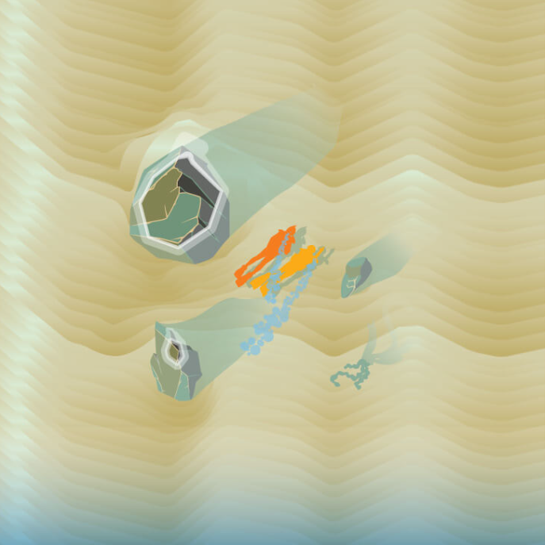
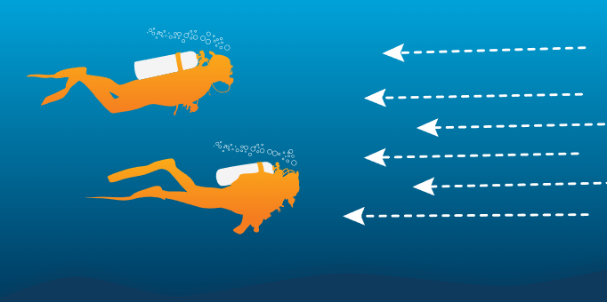
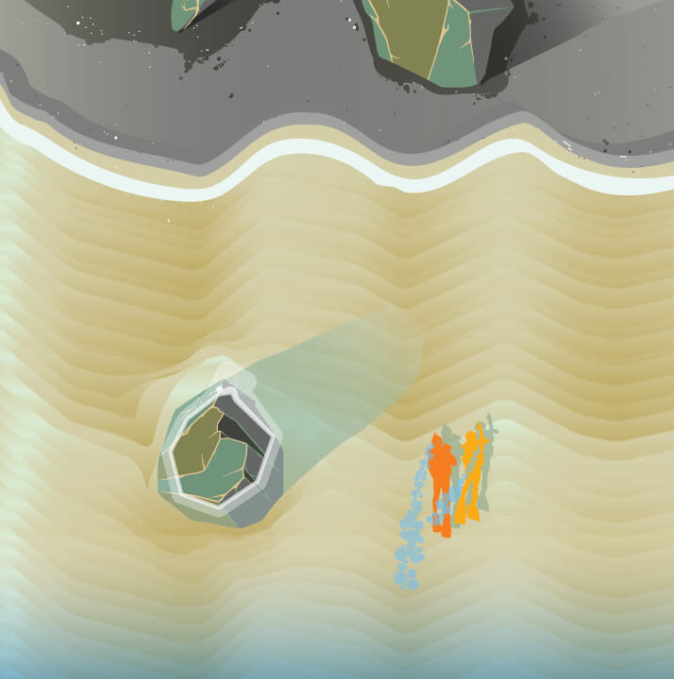
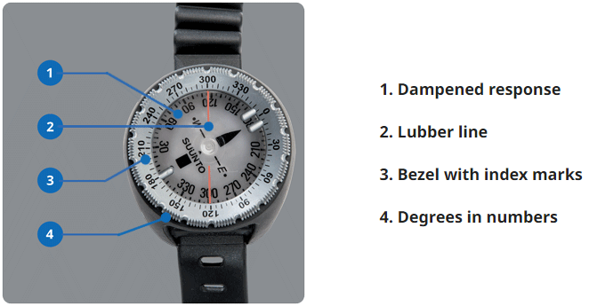
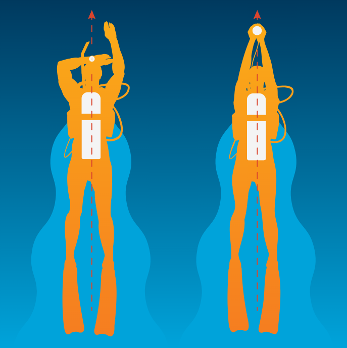
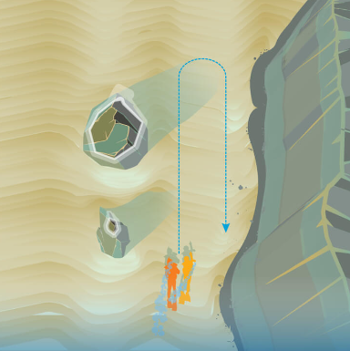
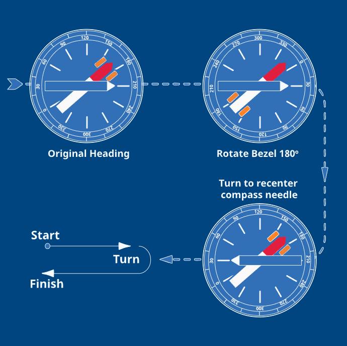
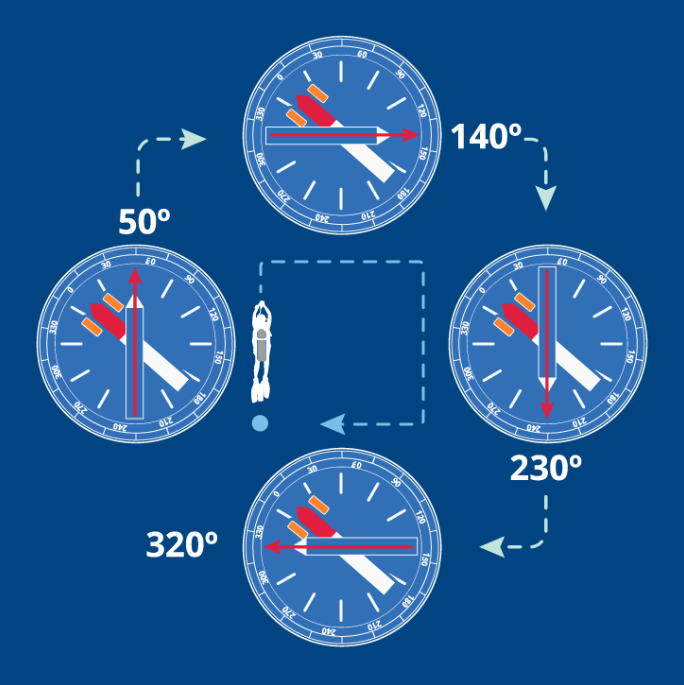

# Advanced Open Water
## Underwater Navigation
### Underwater Navigation Introduction
Underwater navigation has a lot of benefits, including:
* Reduces Anxiety and Confusion
  * Being lost underwater can cause anxiety which can result in more air consumption
  * Navigation removes the confusion and the uneasy feeling of being lost as you always know where youre going and where the exit point is
* Helps Avoid Long Surface Swims
  * if you cant navigate well underwater, the only way to get to your destination and back is by surface swimming
  * this is more boring, more tiring and depending on boat traffic, more dangerous
* Increases Dive Plan Effectiveness
  * Takes out the guesswork about time and gas needed
  * Instead of trying to find a place, you know how to get there, which means you spend more time at your objective instead of searching for it
* Helps Avoid Buddy Separation
* Conserves Gas
  * Anything that saves time in turn saves gas. Which means more time doing what you want to do on the dive.

### Distance Estimation
For navigation, theres two main things:
* Which direction
* How far youve traveled

There are 3 different ways to estimate your distance:

#### Kick Cycles

You can track a kick cycle of one cycle of leg kick. That is, when you leg returns to its original position. When diving, you can count these cycles and figure out how far you have traveled. for example, if you know you travel around 0.75m with each kick, then with 50 kick cycles you would have traveled around 37.5 meters. if you did 100, you know youve traveled around 75m. Try and keep your leg pace the same whilst counting

If you are in a current, it may affect your speed, but normally the in and out flow will cancel each other out.

Kick cycles are particularly useful for measuring medium to long distances, and have the advantage of allowing you to stop, if necessary, and then resume your distance estimation. However, changes in your gear may affect kick cycles from one dive to the next. The size and stiffness of your fins, drag from a larger cylinder or accessories

#### Elapsed Time
You can also gauge distance underwater by measuring the time it takes to swim a known distance. If you know it takes you 30 seconds to swim about 30 metres.
As with kick cycles, swim at your normal, relaxed pace. The primary disadvantage of measuring distance with elapsed time is that if you stop or pause, you can throw off the measurements.

#### Cylinder Pressure
You can use gas pressure to measure distances much as you use elapsed time, because at about the same depth and activity level, your gas consumption is relatively uniform. For example, to swim a square you could swim until you’ve used 15 bar, turn 90 degrees and swim until you’ve used another 15 bar and so on until you return to your starting point

### Natural Navigation
Natural navigation is navigation based on what you observe in the environment – that is, navigation that isn’t based on an instrument. Finding direction from patterns in the sand, following the slope of a reef, or swimming against the current are all forms of natural navigation

#### Predive Observations
Natural navigation begins before you dive, by looking at the environment for navigational references. From the surface, you can usually tell a great deal about what you’ll encounter underwater

* Water motion
  * The direction of waves, currents and tides, while changeable, usually remains consistent over the length of a dive
* Sun direction and angle
  * Before getting in to the water, check how shadows fall and where the sun is in relation to your planned travel direction
  * Even in turbid water you can usually determine where the sun is, and use it to orient yourself.
* Objects and formations
  * It’s useful to note the position of reefs, piers, kelp beds, buoys and other objects so that you know where you are when you encounter them underwater
  * In clear water, you may see a submerged reef or wreck from the surface. Waves breaking offshore may indicate a shallow reef or sandbar

#### Depth finder
If you’re diving from a boat with a depth finder, you’ll be able to see a picture of the bottom. Depth finders can show you bottom contours, wrecks and reefs, all of which can be references that indicate where you are during the dive. Most depth finders give you a relative idea of depth changes, but not usually a wide area picture

#### Descents
You improve navigation by maintaining your orientation as you descend. Start by orienting to your travel direction – know whether it’s to your right, left, ahead, etc. 

#### Sun and shadows

Noting the sun’s angle predive as mentioned, underwater you have a visual reference almost any time of day, but especially in early morning or late afternoon when the sun is lower on the horizon and casts distinct directional shadows. To use the sun and shadows for navigation, note their direction relative to your planned course.

For example, at the start of a dive you note the sun is on your right and/or underwater shadows are to the left. If you get disoriented during the dive, turn so the sun’s on your right and shadows are to your left. This faces you in your original direction. If you turn so the sun’s on your left, you face the direction you came from. Changes in light intensity can cue you to depth changes.

#### Water motion

Currents provide a sure method of underwater navigation. If you’re drift diving, the current naturally navigates for you, carrying you where it will. In most cases, however, you swim against the current, with the flow giving a constant bearing. Be aware that currents can shift direction during a dive, especially when tides change. Plan your dive with this in mind, so that the current helps you return to your exit at the end of the dive. Pay attention to current direction and speed as you descend.

Waves passing overhead cause surge. Surge is a reliable reference because the back-and-forth motion swings to and from shore or shallow areas. You feel it most strongly in shallow water. However, large swells can make surge noticeable in even relatively deep water. When diving in surge, note the water movement to determine the direction toward shore

#### Bottom composition and formations

Sand ripples are a good example; they form perpendicular to the water flow. In lakes and the ocean near a shoreline, sand ripples generally lie parallel to shore; by swimming perpendicular to the ripples, you’ll head toward or away from shore usually (easily judged by whether you’re getting deeper or shallower). Swimming along them, you travel parallel to shore.

### Compass Navigation
There are two types of compasses, analog and electronic (within a dive computer), they both can be used te same way.

#### Holding the compass
hold your compass level, facing your travel direction. Align the lubber line – an imaginary line through the center of the compass, though it may be marked – squarely with your body centerline, pointed in your travel direction. Set the bezel by rotating it until the index marks straddle the needle. This provides a visual reference that you’re on course

To swim holding a heading, keep the compass centered with your body and travel along the lubber line (the needle always points north and the lubber line is always your travel direction) keeping the needle within the index marks (analog) or following the heading number (electronic). Look over the compass as you swim, so you watch where you’re going

* Trust the compass
  * If you’re new to compass navigation, sometimes it feels like it’s misleading you. More often than not, the compass is right and your sense of direction is off
* Use natural references
  * The combination of natural navigation with compass navigation is the most effective navigation. The compass closes gaps where you can’t effectively navigate with landmarks, and natural navigation helps offset any mistakes you make using your compass.
* practice on land
  * If you’re not used to how your compass works, give it a dry run on land. It works exactly the same at the surface, so you can get used to it without wasting dive time.

* allow for the effects of currents
  * A compass helps you swim in a straight line, but water movement such as currents or surge can carry you off course. If currents are common in your local area, your instructor may teach you how to navigate accordingly
* share responsibilities midwater
  * If you’re navigating in midwater, have one buddy read the compass and the other monitor depth. The depth buddy can hold the compass buddy’s arm to keep the team together while watching instruments. If you’re in a three-person team, you can make life even easier by further dividing responsibilities.
* use patterns
  * Although you can effectively navigate a random pattern without losing your way, it’s easier to follow a basic course. Navigate around obstacles. When following any course, don’t let something in your path throw you off. Detour around it and resume your course
* use intentional error on long distances
  * If you’re looking for a small, specific destination a long distance away, chances are you’re going to miss. Even the best underwater navigation just isn’t that precise when you start swimming hundreds of metres/feet. So, aim for slightly to the right or left of your target. If you miss your mark (you usually do), you know which way to search.
* take your time
  * Compass navigation will not zero you in like GPS (more about some of these technologies shortly), but with practice you can find your way to within several metres/feet – which is more than accurate enough
* remember the dive first
  * Navigation is an important skill, but remember “Dive First, Situation Second, Communicate Third.” Give priority to proper buoyancy, managing your gas supply and watching your no stop time.

### Using Navigation Patterns
It’s much easier to know where you are and where you’re going if you follow a predetermined pattern instead of swimming about randomly

you actually see more than you would by wandering aimlessly. You use your limited gas and bottom time more effectively when you use a pattern suited to the dive site. Out-and-back lines, squares/rectangles, triangles and circles are commonly used navigation patterns, each with its own characteristics

#### Out and Back Line / Reciprocal

This is the most common, you simply go out in a direction, making notes of what is around you and using that as a line. For example, a rock face to your right and then on the return, keep it on your left. you can use a compass to keep track of your heading

The Reciprocal course is similar, but it just uses the compass to return the way you came.
* Outbound
  * follow your compass along a single heading, eg, 210
* Inbound / return
  * rotate the bezel (analog compass) 180 degrees, then turn until the needle is again within the index marks. You’re facing your return heading. With dive computer it may have an indicator for every 90deg you have turned.

#### Square Course
Squares and rectangles cover more area, and suit both natural and compass navigation. Three legs of a square/rectangle are usually the easiest way to navigate around an obstacle. You may or may not have to measure distance to get a useable pattern.

An example of a natural navigation rectangle pattern would be to swim out from shore, turn 90 degrees and swim parallel to shore, then turn 90 degrees toward shore. In shallow water, you turn 90 degrees to swim parallel to shore toward your entry point. Using depth, contours and other navigation cues around you, and with a large entry/exit area, you may be able to navigate this pattern effectively without using your compass or measuring distance. But, if you need to follow the pattern very precisely

To compass navigate a square or a rectangle, begin by setting a heading for the first side and swimming the desired distance – use kick cycles, time or cylinder pressure to measure. Rotate the bezel 90 degrees and turn to realign the needle within the index marks. In this case, your initial heading is 50°, followed by 140°, 230° and 320°.

Add 90 degrees for a right turn, or subtract 90 degrees for a left; this is also how to find your headings when using an electronic compass that shows only headings. When adding, due North is 0 degrees; when subtracting it is 360 degrees.

Swim along the new heading the desired distance, then rotate the bezel another 90 degrees in the same direction (right or left) for the next turn. Repeat the process until you complete the pattern.

#### Tips

1. If possible, discuss and agree on the pattern with your buddy before the dive. You can’t always do this – you may not know you need a pattern until you’re diving – but doing so settles who will navigate, the pattern direction, etc.
2. Visualize the pattern prior to and during the dive. If you create a mental bird’s-eye view, you can get an idea of where you are relative to the pattern and what’s around you.
3. Keep patterns small and move slowly.
4. When you must deviate from a pattern (such as going around an obstacle), remember your heading so you can return to it.
5. It’s generally most effective to have one buddy in charge of navigating the pattern.
6. As appropriate for the dive depth and location, it may help to surface and check your position periodically.

### Other Navigational Devices
