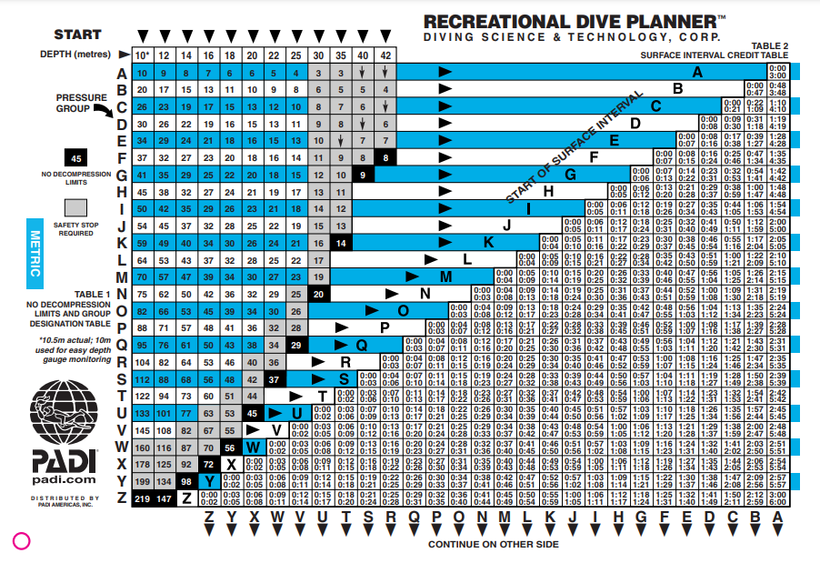
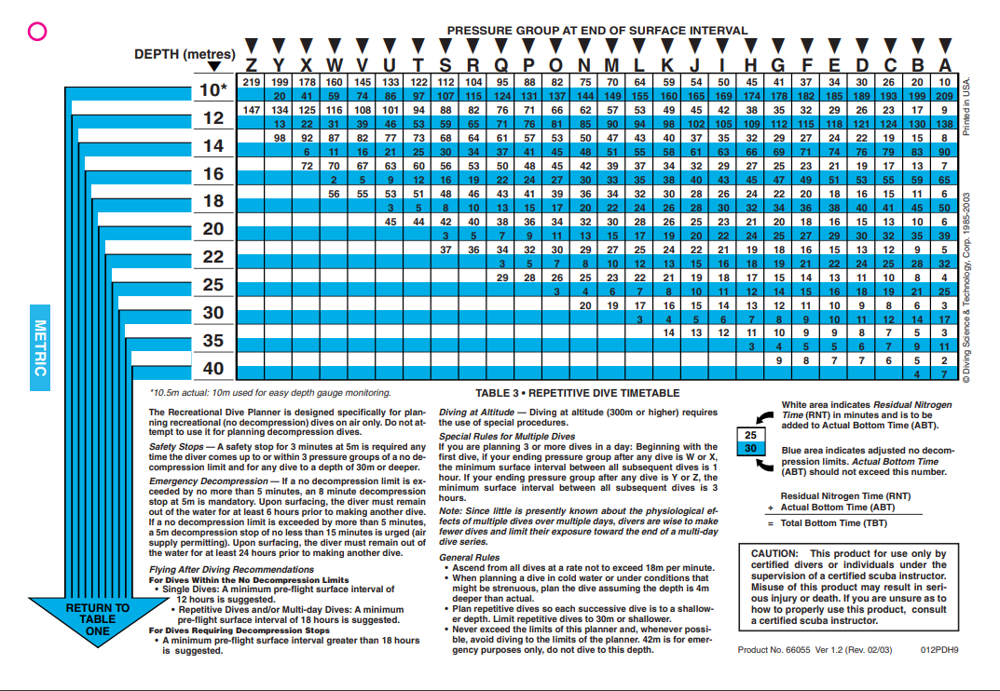
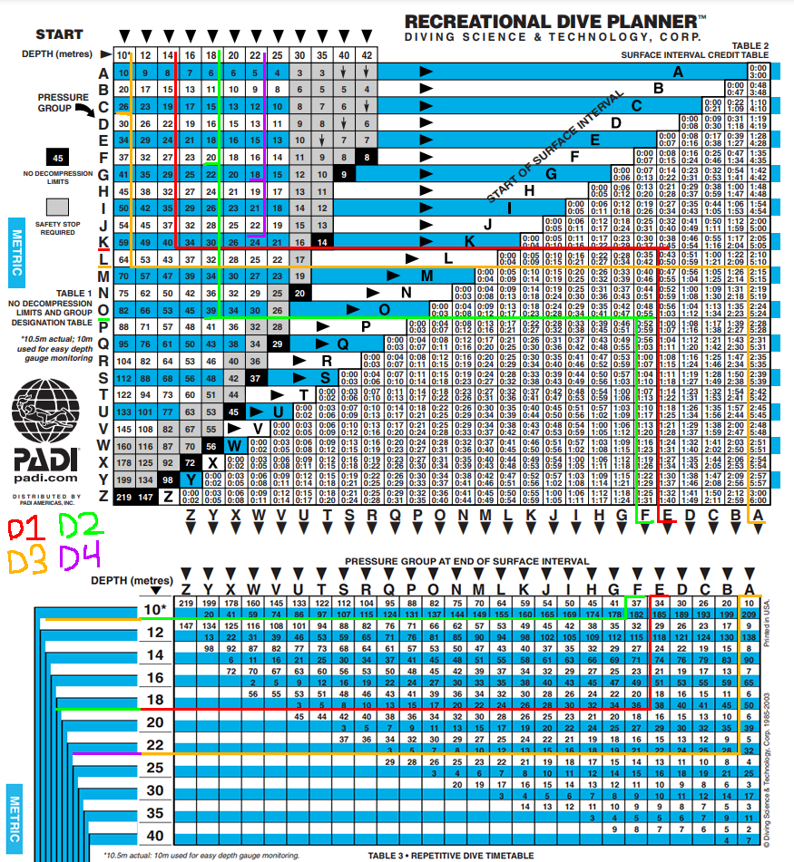

# Dive Table
## How to read PADI Dive Table

Above is the PADI Dive table (Recreational Dive Table), it's needed to see how much residual nitrogen is in our blood when doing multiple dives.

Also there is a [NAUI RPD](/NAUI/DiveTable(RPD).md) which is very similar

### Step by Step
1. Pick your depth (first image, top numbers)
2. Pick your duration (go down from the depth number to the time, round up)
3. Go along to the left from the duration number to find pressure group
4. Go along to the right and find your time that you spent out of the water (surface interval time) (the two numbers in between are the range, if you stay out for 45 minutes, find the range that contains that number)
5. Once you have found the range, go down, that is your new pressure group
6. Switch to the second image, find the pressure group at the top, and go down the till you reach the next dives max depth
7. There will be two numbers, white = residual nitrogen time (RNT) blue = No decompression limit. You will need to add your RNT to your next dive time (which will be called actual bottom time ABT)
8. If you add those two numbers together, that will equal your max dive time which you cannot exceed
9. with the RNT noted, go back to the first image and start from the beginning but whatever number you find, you must add your RNT to it to find your ABT

### Examples
[Video Example](https://youtu.be/s2_1do9HymI)

* Dive 1 (red) is `14 meters` for `38 minutes`
  * Our pressure group when leaving the water would be `K`
  * We stay out of the water (surface interval) for `40 minutes`, resulting in our new pressure group being `E`
* Dive 2 (green) is `18 meters`, meaning our residual nitrogen would be `18 minutes`
  * Our max dive time for this depth would be `18 + 38 = 56 minutes`
  * The dive is for `20 minutes`, so our total dive time is `20 + 18 = 38 minutes`
  * Our pressure group when leaving the water would be `O`
  * We stay out of the water (surface interval) for `50 minutes`, resulting in our new pressure group being `F`
* Dive 3 (orange) is `10 meters`, meaning our residual nitrogen would be `37 minutes`
  * Our max dive time for this depth would be `37 + 182 = 219 minutes`
  * The dive time is `23 minutes`, so our total dive time is `37 + 23 = 60 minutes`
  * Our pressure group when leaving the water would be `L`
  * We stay out of the water (surface interval) for `3 Hours`, resulting in our new pressure group being `A`
* Dive 4 is `22 meters`, meaning our residual nitrogen would be `5 minutes`
  * Our max dive time for this depth would be `5 + 32 = 37 minutes`
  * The dive time is `18 minutes`, so our total dive time is `5 + 18 = 23 minutes`
  * Our pressure group when leaving the water would be `K`