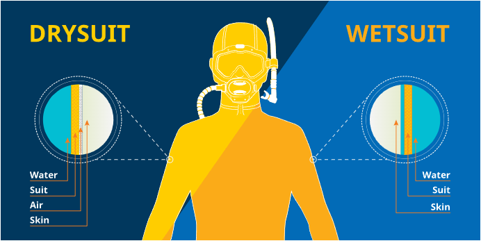

# Dry Suit Diver

## Dry, Wet, and Body Suits

* Body Suits
  * Thin layer, normally lycra
  * help against sunburn and abrasions
  * minor thermal protection
  * can be used as another layer within a wet suit

* Wet Suit
  * Neoprene foam, similar to a sponge (closed cell foam)
    * the closed cell bubbles trap nitrogen / air, why they are buoyent
  * Water seeps in and gets trapped between you and the suit - the body heats the water which act as another layer between you and the colder water
    * however it is still the neoprene, not the water, that is insulating you
  * The thicker the neoprene, the better the insulation - as it will keep the heat in and stop it from circulating

* Dry suits
  * Make use of water proof zippers and seals around neck and wrist to keep you dry.
  * It traps air or another gas (Argon, eg, about half heat capacity of air)
  * Due to air having a lower heat capacity than water - it will act as an insulator
  * everything between you and the water slows the heat loss
  * normally wear a insulating undergarment
  * Some seepage can happen at the wrists when flexing - move te seal higher up the arm

* Dry suit advantages
  * warmer than a wet suit
    * Reduce hyperthermia risk in cold water
  * potentially more dives in the day
  * reduce air usage
    * you breath more when cold
  * can warm up quicker in a dry suit when out the water than a wet suit
    * help against air temps
  * insulation is constant, regardless of depth
  * don't have to fit super closely unlike a wet suit
  * can make quick and easy field repairs
    * wet suits require it to be dry before repairs
  * can adjust insulation
  * no cold shock when getting into cold water first
* Dry suit Disadvantages
  * Cost more
  * more bulk
    * can cause you to tire
  * need more weight
    * as you have air in your suit you need to weigh yourself down more than a wet suit
  * require more care and maintenance
    * pre and post dive
    * even carrying it and how you store it
    * focus on seals, zippers and valves
  * uncomfortable seals

Theres no best suit - it depends on what you want to do in what water
Factors to consider:
* water temp
* your thermal characteristics
* activity level
* depth
* duration
* weather