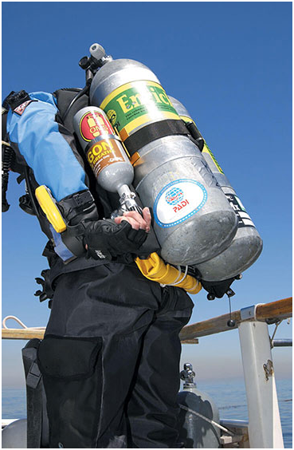

# Dry Suit Diver
## BCDs, Weight Systems, and Argon Inflation
### BCDs
* should always ue a BCD when diving, regardless of suit type
  * safety, if your suit floods or need to control buoyancy
  * near the surface, it takes a lot of gas to fill your suit for buoyancy

### Weights and weight systems
* Dry suit diving, you will need to change your needed added weight
  * This depends on the type of suit you are wearing
  * The weight belt works fine but may want to look for alternatives systems
    * ankle weight (uncommon)
    * BCD integrated weight systems
    * weight harness
  * Its good to use smaller weight blocks so incrementally increase weight and in different areas around the suit
  * its normally best to choose two weight systems and evenly distribute that
* You should have your weights accessible to you
  * incase of needed buoyancy
  * you dont have to ditch all your weights, just enough to create a slow and stead climb

### Argon Systems
* instead of filling suit with air, you can use argon
* has a lower heat capacity than air, meaning better insulation
* also not using your air tank, meaning potentially longer dives
* normally a smaller tank along side your air tank
  * mounted valve facing downwards for ease of access of valve
* Argon does have unknown risks of breathing it in after a dive, and general skin irritation

