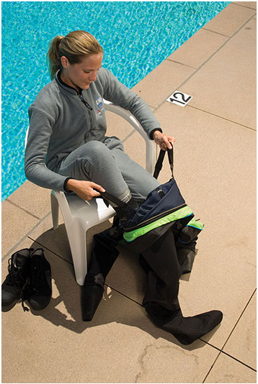
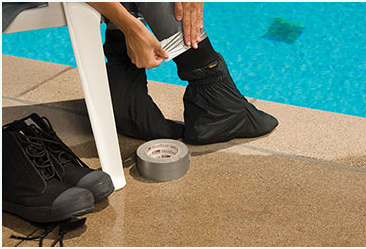
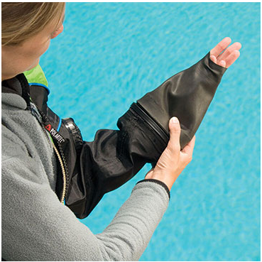
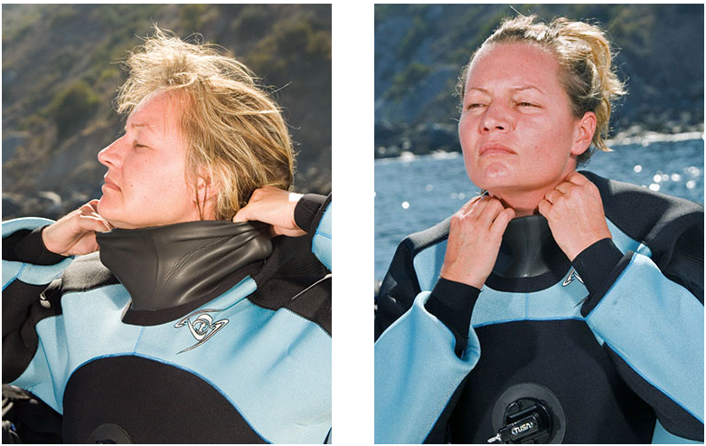

# Dry Suit Diver
## Diving Dry Suit
### Putting on the suit
* if it is a warm day, gather all your equipment, and then at the very last moment before you are ready to dive, put your gear on
  * you can overheat if you put it on too early on a warm day
  * cooler days are ok, or at least the undergarments
* Remove jewelry and such

Steps:
* If the suit has a telescoping torso, disconnect it and extend to full length
* put your legs into the suit, once in secure boot straps
  * 
  * If your undergarment has detached socks, put the socks over the undergarment pant legs so the legs don’t ride up as you slide into your dry suit. You can also overlap a loose piece of duct tape around the sock cuff to keep everything in place.
  * 
* Apply talcum powder or recommended lubricant on seals
* pull the suit up and on, being careful not to strain or damage the zipper
  * You put in your arms first, and then put your head through the neck seal
* Latex seals
  * wrist
    * cone your fingers and user your other hand to spread the seal
    * 
  * Neck
    * use a hand on either side to pull open the seal and put your head through
  * Make sure no debris, dirt or hair are under the seal
* Neoprene seals
  * Wrist
    * Similar to latex, cone your fingers and use other hand to slide the seal over
    * if fold under type, tuck the seal back under
  * neck
    * normally fold under type
    * pulling the seal down, a hand flat on either side, until the top edge just clears your chin. Then without letting go or stopping, curl your fingers in to fold in the outer edge against your neck. Work your fingers all the way around to be sure the folded in layer lies flat against your neck with no wrinkles or hair trapped underneath. It may help to have your buddy lend a hand.
    * 
* next is to close the zipper
  * May need help closing it off
  * once its closed git it a customary tug to make sure it is closed
* Purge the suit
  * needed to reduce excess air, which will balloon around neck and shoulder when entering water
  * Hold open the neck seal or press the exhaust valve, and crouch into a ball
* now put on the rest of the gear (BCD, etc)

TLDR; steps:
1. put legs in suit
2. lube seals if needed
3. pull up suit and put wrists and neck through suit
4. close zipper
5. purge suit
6. put on rest of gear (BCD, etc)

### At the surface
* start with putting some air in the BCD to make sure positive buoyancy
* need to again purge the suit as there will still be excess air
  * hit the exhaust valve
  * needed for comfort and that you will be too buoyant
* Need to check weight
  * Open automatic exhaust valve all the way
  * Release all air from BCD
  * adjust your weight in small increments until float at eye level while holding normal breath
  * if checking weight with a full tank, after finding out how much is needed to float at eye level, add about 3kg to compensate the weight you lose as you consume air
  * you should be able to maintain a safety stop at 5meters with a nearly empty tank
* **Proper weight is extra important when dry diving**
  * Make sure the weighting is correct

### Underwater
#### Descending
* as you descend, the suit will tighten - lower your left should so gas doesnt vent from the exhaust valve, and add air to avoid suit squeeze and maintain buoyancy
* All shell suits, you will only use the BCD to return to the surface, you control your buoyancy using just the suit, except in an emergency
* Use neoprene you have to use both the suit and the BCD to control buoyancy
* When adding air to your suit, do so in small short bursts of air
  * If you do long bursts in cold water, it may freeze the valve
* when descending, may want to go spread eagle / sky diver position
  * helps the gas migrate throughout the suit for uniform insulation
  * and causes drag to help control descent
* the automatic valve should open and close depending on how much gas is in the suit
  * if properly weighted wont need to adjust the valve much.
* At the bottom, may want to adjust the valve a half or full turn so gas doesnt trickle out

#### Ascending
* when ascending to a new level or exiting a dive
  * begin with heads up position that puts your exhaust valve at the height point of the suit
  * may tilt slightly to raise your left shoulder
* The exhaust valve should release expanding gas automatically
  * can still do it manually if needed
* If properly weighted you should only need one hand to control ascent
* At the end of the dive, use the BCD for positive buoyancy
* With a neoprene suit, need to release gas from the BCD and the suit
  * a method is to raise your BCD hose in left hand while also raising your left arm
  * you control the BCD and expanding air automatically
* **DRY SUIT IS NOT SUITABLE FOR A BACKUP BCD**